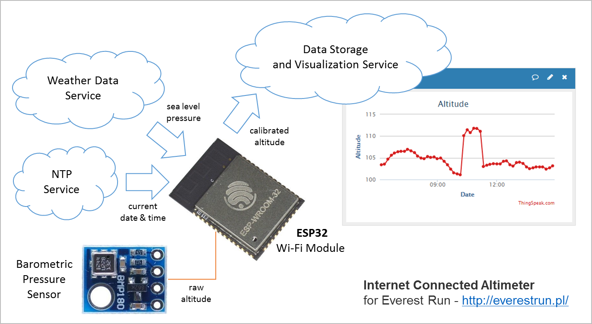

# esp32-everest-run

Internet connected altimeter for Everest Run - http://everestrun.pl/

## Components

1. [ESP32](https://espressif.com/en/products/hardware/esp32/overview) Wi-Fi + Bluetooth Combo Chip by [Espressif](https://espressif.com/)
2. [BMP180]( https://www.bosch-sensortec.com/bst/products/all_products/bmp180) Barmoetric Pressure Sensor
3. [esp-idf](https://github.com/espressif/esp-idf) Espressif IoT Development Framework for ESP32

## Build Status

## Work Progress

- [x] Prepare a prototype using ESP32-DevKitJ-v1 development board
- [x] Develop an I2C driver to read altitude from BMP180 sensor
- [x] Synchronize time on ESP32 by obtaining it from a NTP server
- [x] Compensate altitude measurement using [sea level pressure](https://en.wikipedia.org/wiki/Atmospheric_pressure#Mean_sea_level_pressure) obtained on-line
- [x] Publish altitude measurements in real time on [ThingSpeak](https://thingspeak.com/channels/208884) and [KeenIO](https://keen.io)
- [x] Implement data buffering on ESP32 for the period of likely Wi-Fi connection losses
- [ ] Build lightweight, battery powered altimeter using bare [ESP-WROOM-32](https://espressif.com/en/products/hardware/esp-wroom-32/overview) module
- [ ] Test altimeter during weekly trainings organized by the group [Biegamy po schodach](https://www.facebook.com/groups/biegamyposchodach/)
- [ ] Complete [Everest Run](http://everestrun.pl/) by climbing 2730 floors on 18 and 19 February 2017

## Altitude Measurements On-line

Test data feed is available under https://thingspeak.com/channels/208884

## Log Book

For more details on project progress, please check [log book](log-book.md).

## Installation Overview

Configure your PC according to [ESP32 Documentation](http://esp-idf.readthedocs.io/en/latest/?badge=latest). [Windows](http://esp-idf.readthedocs.io/en/latest/windows-setup.html), [Linux](http://esp-idf.readthedocs.io/en/latest/linux-setup.html) and [Mac OS](http://esp-idf.readthedocs.io/en/latest/macos-setup.html) are supported.

You can compile and upload code to ESP32 from command line with [make](http://esp-idf.readthedocs.io/en/latest/make-project.html) or using [Eclipse IDE](http://esp-idf.readthedocs.io/en/latest/eclipse-setup.html).

If this is you first exposure to ESP32 and [esp-idf](https://github.com/espressif/esp-idf), then get familiar with [hello_world](https://github.com/espressif/esp-idf/tree/master/examples/get-started/hello_world) and [blink](https://github.com/espressif/esp-idf/tree/master/examples/get-started/blink) examples. In next step check more advanced examples that have been specifically used to prepare this application: [http_request](https://github.com/espressif/esp-idf/tree/master/examples/protocols/http_request), [sntp](https://github.com/espressif/esp-idf/tree/master/examples/protocols/sntp) and [sd_card](https://github.com/espressif/esp-idf/tree/master/examples/storage/sd_card).

Compilation and upload of this application is done in the same way like the above examples. To make testing more convenient you can use [ESP-WROVER-KIT](https://espressif.com/en/products/hardware/esp-wrover-kit/overview) that has micro-sd card slot installed.

## Acknowledgments

This application is using code developed by:
* [jsmn](https://github.com/zserge/jsmn) a minimalistic JSON parser by Serge Zaitsev
* Software I2C library for ESP31B by Hristo Gochkov
* [http_request](https://github.com/espressif/esp-idf/tree/master/examples/protocols/http_request) example by Angus Gratton
* [sntp](https://github.com/espressif/esp-idf/tree/master/examples/protocols/sntp) example by Ivan Grokhotkov
* [sd_card](https://github.com/espressif/esp-idf/tree/master/examples/storage/sd_card) example by Ivan Grokhotkov

