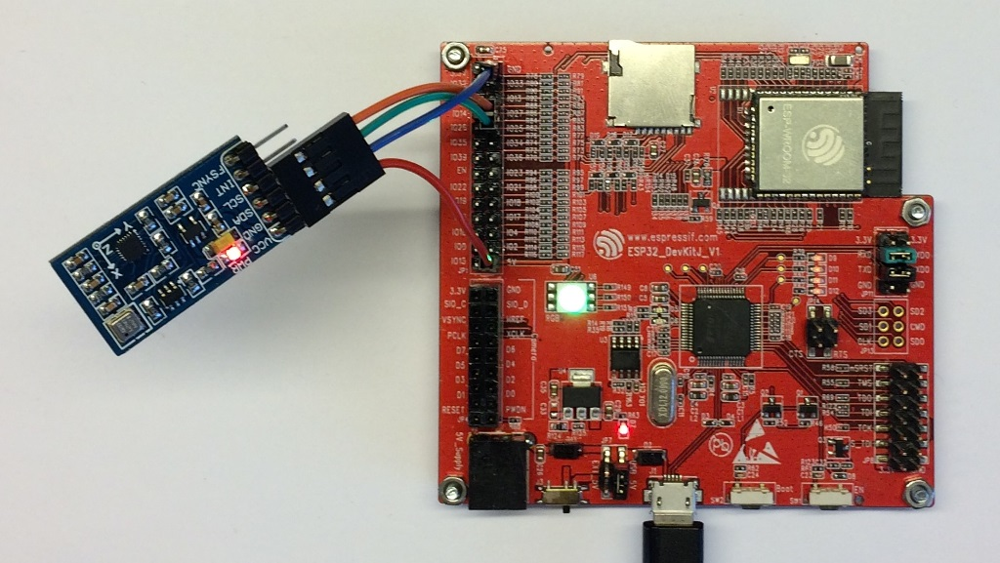
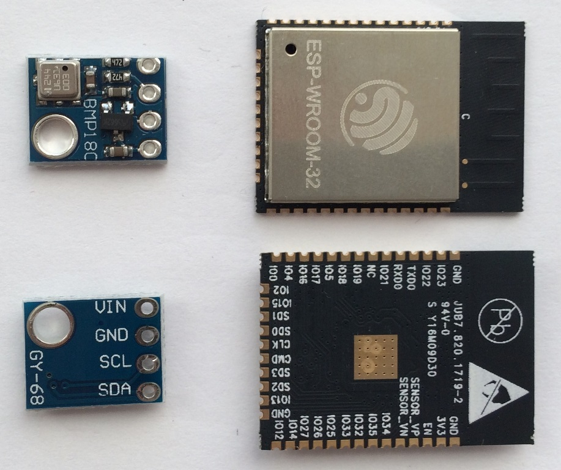

## Log Book

To reach the top of [Mount Everest](https://en.wikipedia.org/wiki/Mount_Everest), it usually takes years of preparation and thousands $ spent on equipment. [Everest Run](http://everestrun.pl/) makes it far more achievable and easier by letting you climb the highest peak of the Earth in the center of Warsaw! Well, far easier but still tough. To make it, you need to climb 2730 floors and it takes at [least 14 hours](http://everestrun.pl/wyniki-on-line-mer-2016/).

### About - December 18th, 2016

The number of people willing to participate in [Everest Run](http://everestrun.pl/) is always bigger then the limit of 200 places. I made it to the participant list only in second attempt. Some people did not pay the entrance fee and second draw was open. Now I am officially signed up for the [Everest Run](http://everestrun.pl/). My start slot is at 12:00 on February 18th, 2017.

### The Story - December 19th, 2016

I assessed my climbing time to be about 16 hours. This is a lot of time, beyond my imagination as for a continuous workout. Starting at 12:00 noon, I will be done next day by 4 in the morning! To be able to prove it later on to myself, that I did it, I decided to record progress throughout the race. This turned out to be a great opportunity to design, program and test in action a device to do such recording.

I enjoy development of projects with chips engineered by [Espressif](https://espressif.com/) like [ESP8266](https://espressif.com/en/products/hardware/esp8266ex/overview) and [ESP32](https://espressif.com/en/products/hardware/esp32/overview). They are powerful, cheap and widely used by [enthusiastic community](https://hackaday.com/tag/espressif/). For this project I have selected ESP32 - a nice tiny Wi-Fi + Bluetooth Combo Chip launched just couple of months ago, on September 1st, 2016. ESP will record climbing altitude with a digital pressure sensor and post results to the cloud for later review.

### First training - December 21st, 2016

To get familiar with challenge to face, I have joined group [Biegamy po schodach](https://www.facebook.com/groups/biegamyposchodach/) and started training. The first happened to be at the race place - Marriot hotel. I have climbed 42 floors 6 times, which made total of 252 floors completed within about 1 hour 30 minutes.

### First components are there - December 23rd, 2016

I found the core elements of altimeter under the Christmas tree. Good things come in pairs and here they are:
- [ESP-WROOM-32](https://espressif.com/sites/default/files/documentation/esp_wroom_32_datasheet_en.pdf) module
- 10 DOF IMU Sensor with [BMP180](https://www.bosch-sensortec.com/bst/products/all_products/bmp180) barometric pressure sensor on board


### First s/w release - December 28th, 2016

I have started with adopting existing s/w to read BMP180 sensor. Hardware I2C driver required for reading was not available yet in [esp-idf](https://github.com/espressif/esp-idf). Instead, I look for a bit bang s/w driver. I selected I2C library for ESP31B by Hristo Gochkov published within [esp32-cam-demo](https://github.com/igrr/esp32-cam-demo) by Ivan Grokhotkov. It worked great. I have added a simple function to scan I2C bus to discover addresses of BMP180 sensor and MPU9255 to be sure I have some response from 10 DOF IMU Sensor board. Then implemented the code to read individual BMP180 registers, calculate pressure and temperature out or raw values and finally calculate the altitude.

Then basing using example code provided in [examples folder](https://github.com/espressif/esp-idf/tree/master/examples) of esp-idf repository, I have added SNTP component to retrieve current time on-line from NTP server.

I have also published initial version HTTP request code. This one was also based on example taken from esp-idf repository.



All the testing has been done with [ESP-WROVER-KIT (DevKitJ)](https://espressif.com/sites/default/files/documentation/esp-wrover-kit_getting_started_guide_en.pdf). It that features several convenient connectors and features including JTAG interface, SD card slot, camera header, RGB LED, etc. as well as FT2232 USB to serial chip providing two USB channels and up to 3M Baud transfer speed.

### Second training - December 28th, 2016

Training took place in InterContinetal hotel. The place was nice with great view on Warsaw by night from the windows on the staircase. The climbing track was from level -5 to floor 43 completed 7 times. This makes 336 floors.

### Convert barometric pressure into altitude - January 1nd, 2017

Barometric pressure changes with altitude. It decreases as we climb up and increases, as we are going down. This relationship is described with specific [formula](https://en.wikipedia.org/wiki/Atmospheric_pressure#Altitude_variation) that we can transform and use to convert from pressure back to altitude.

Barometric pressure also changes with weather conditions. If we are not moving and the pressure changes, we would get changing altitude readings. We would not like false readings!

But the [formula](https://en.wikipedia.org/wiki/Atmospheric_pressure#Altitude_variation) already accounts for that. For calculations we also need to provide pressure measured as we were at the sea level.

How do we get the pressure at the sea level? By retrieving it form weather service specifically for our location. For this purpose I have selected https://openweathermap.org/.

By sending query like:
```
http://api.openweathermap.org/data/2.5/weather?q=London,uk&appid=12345678901234567890123456789012
```
We are getting back the following [JSON](https://en.wikipedia.org/wiki/JSON) string:
```
{"coord":{"lon":-0.13,"lat":51.51},"weather":[{"id":701,"main":"Mist","description":"mist","icon":"50d"},{"id":300,"main":"Drizzle","description":"light intensity drizzle","icon":"09d"},{"id":520,"main":"Rain","description":"light intensity shower rain","icon":"09d"}],"base":"stations","main":{"temp":282.48,"pressure":1031,"humidity":87,"temp_min":282.15,"temp_max":283.15},"visibility":10000,"wind":{"speed":2.1},"clouds":{"all":90},"dt":1483890600,"sys":{"type":1,"id":5091,"message":0.0072,"country":"GB","sunrise":1483862621,"sunset":1483891910},"id":2643743,"name":"London","cod":200}
```
Among provided values we can find `"pressure":1031` we are looking for.

Basing on HTTP request code from es-idf [examples folder](https://github.com/espressif/esp-idf/tree/master/examples) it was quite easy to implement data retrieval from https://openweathermap.org/.


### Posting with ESP32 to ThingSpeak - January 1st, 2017

HTTP request code turned out to be really useful as a standalone component. I has been reused to post data to [ThingSpeak](https://thingspeak.com/channels/208884).


Picture above shows pressure measurement (left), which is then converted into altitude (right). During these measurements the sensor has not been moved at all. Visible drift of altitude up (as the pressure goes down) indicates lack of compensation from pressure changes due to weather conditions. This issue will be addressed separately in next stages of this project.

### Separate BMP180 sensors - January 2nd, 2017

Initial selection of 10 DOF IMU Sensors was overkill. I do not need accelerometer, gyroscope and magnetometer. All I really need is the pressure sensor to covert barometric pressure into altitude. To make my design smaller and consuming less power I decided to order another break board with BMP180 sensor only. It just arrived. As ESP32 is operating on 3.3V I would like to standardize design on this particular voltage. To do so, I plan to bypass power regulator that is in place to power the BMP180 break out with 5V.



The BMP180 break boards are cheap, so I have ordered two of them. With 10 DOF IMU Sensor boards I have, one of them provided pressure measurements off by about 7%. It is always better to have some equipment redundancy for comparison and backup in case of h/w failure.

### Third training - January 3rd, 2017

Organizers rotate the training places and this one was [Palace of Culture and Science](https://en.wikipedia.org/wiki/Palace_of_Culture_and_Science). The track leads through three staircases with total of 26 floors. I climbed it 13 times making altogether 338 floors. Going downstairs during training and the race is always using elevator. There are six elevators available for us. Since the training is in the afternoon after working hours, we can go down with almost no waiting for elevator to come.
